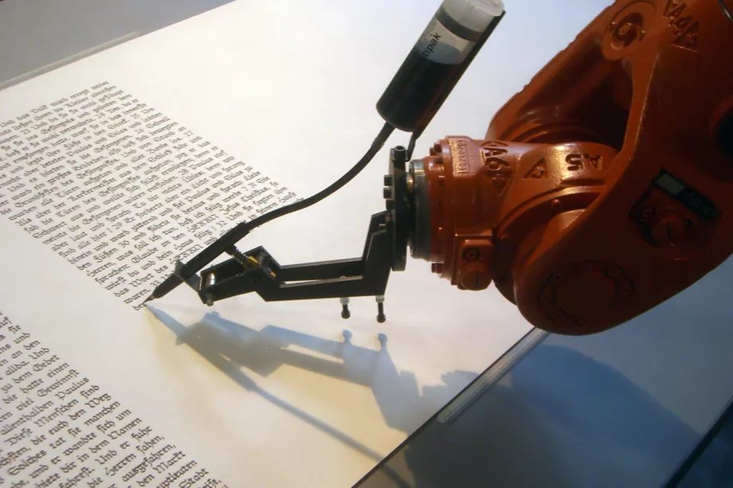
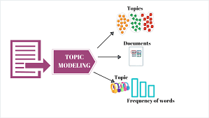
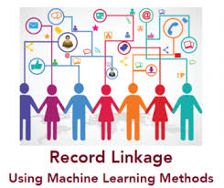
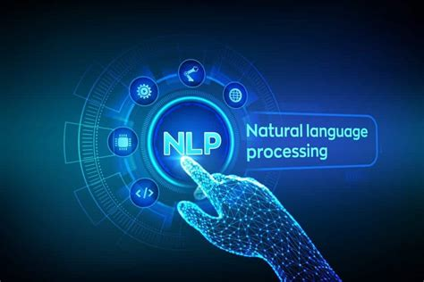
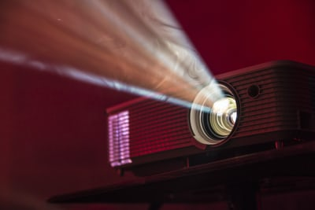
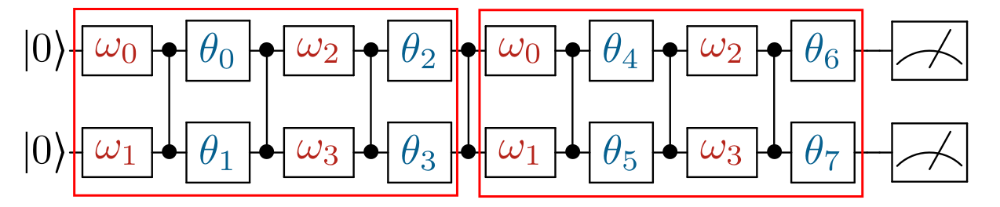
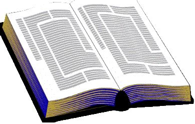
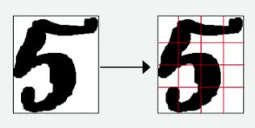
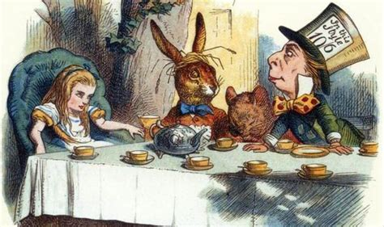
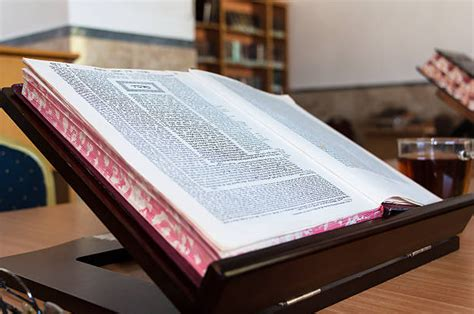

# **Yishai's Portfolio**

## **Table of Contents:**

### *Professional Projects:*
- Machine Learning:
    - [Text Generation](#Text-Generation)
    - [Record Linkage](#Record-Linkage)
    - [Topic Modeling](#Topic-Modeling)
    - [Text Classifier](#Text-Classifier)
    - [Keyword Finder](#Keyword-Finder)
    - [Quantum Classifier](#Quantum-Classifier)
- Not Machine Learning:
    - [FinTech Extractor](#FinTech-Extractor)
    - [Reference Extractor](#Reference-Extractor)
    - [Sefer Maker](#Sefer-Maker)

### *Academic Projects:*
- Machine Learning:
    - [Bert Classification](#Bert-Classification)
    - [Neural Network](#Neural-Network)
    - [Image Classifiers](#Image-Classifiers)
    - [Digit Prediction](#digit-prediction)

- Not Machine Learning:
    - [Story Illustrator](#Story-Illustrator)
    - [Screen Capture](#Screen-Capture)
    - [Gemara Scraper](#Gemara-Scraper)
    - [Physics Thesis](#Physics-Thesis)

---

##  **Text Generation:** 
- Automatic completion of words and sentences.
- Helps employees write and comment on debriefs about experiences at work.
- Incorporates words already written in orderto predic the most likely continuation.
- Learn more about the company [here](https://www.shamaym.com/).

    
    
Back to [Table of Contents](#Table-of-Contents)

---

##  **Topic Modeling:** 
- Multi-label classifier which automatically places debriefs into appropriate subjects.
- Wide range of topics, from presentation skills to meeting management, bug-fixes to customer relationship.
- Learn more about the company [here](https://www.shamaym.com/).

    

Back to [Table of Contents](#Table-of-Contents)

---

##  **Record Linkage:** 
- Deduplicates different records that in fact refer to the same healthcare professional. 
- Based on diverse fields of data, including birthdate, address, middle name, and license numbers. 
- Learn more about the company [here](http://www.streamlineverify.com).

    

Back to [Table of Contents](#Table-of-Contents)

---
##  **Text Classifier:** 
- Two-stage hierarchical architecture.
- Very precise multi-Label tagging for 4000 topics.
- English and Ancient Hebrew dataset.
- Please [read this article](https://yishairasowsky.medium.com/multi-label-text-classification-d44105d581d6) I wrote about the project.
- You can also [view the code](https://github.com/yishairasowsky/Sefaria-Project/blob/master/ML/scripts/multi_label_classification.py) on GitHub.
- Learn more about the company [here](http://www.sefaria.org).

    
    
Back to [Table of Contents](#Table-of-Contents)

---

## **Keyword Finder**
- Implemented in Hebrew language.
- From an input sentence, this application returns the most important word or phrase.
- Leverages part-of-speech tagging and dependency parsing.
- I cannot show the code, because it belongs to [Slideo](https://www.linkedin.com/in/eladdarmon/).

    

Back to [Table of Contents](#Table-of-Contents)

---

## **Quantum Classifier**
- Implementation of [qlang](https://github.com/exaQ-ai/qlang/) simulator from exaQ-ai.
- Coding and analysis of loss function for quantum circuits on iris dataset classification.
- Please see the code [here](https://github.com/exaQ-ai/yishaiWIP/blob/master/iris/compute_loss.ipynb). 

    

Back to [Table of Contents](#Table-of-Contents)

---

## **FinTech Extractor**
- Created NLP entity extractor for lease contracts using rule-based logic.
- Developed interactive confusion matrix and statistics to evaluate predictions.
- Achieved accuracy of >90% for some entities; boosted precision/recall by 20%.
- I cannot show the code, because it belongs to [SMRTflow](https://www.linkedin.com/company/trullion).

    

Back to [Table of Contents](#Table-of-Contents)
---

## **Reference Extractor**
- Locates technical citiations from legal documents
- Enhanced search algorithm to 90% accuracy
- Used Regex and my own enhancements to refine the search precision and recall
- I cannot show the code, because it belongs to [Waymark.tech](https://www.waymark.tech/).
    
    

<!-- --- -->
Back to [Table of Contents](#Table-of-Contents)

---
## **Sefer Maker**
- Create PDF document of Jewish texts, such as Mishnah, with translations and commentaries.
- Completed using Sefaria's API.
- You can also see [the code](https://github.com/yishairasowsky/SeferMaker) on GitHub.

    

Back to [Table of Contents](#Table-of-Contents)

---

<!-- ## **Academic Projects:** -->
## **BERT Classification**
- Created and documented complete Python modules to load and prepare textual data for BERT Classification.
- Demonstrated the ability to fine tune BERT using two datasets 
    - Amazon product reviews: multiclass classification 
    - News reel: Named entity recognition
- You can also see [the code](https://github.com/yishairasowsky/citi-interview/tree/main/scripts) on GitHub.

    

Back to [Table of Contents](#Table-of-Contents)

---

## **Neural Network**
- Constructed from scratch without third libraries.
- Displays superiority on non-linear dataset.
- Enjoy watching [this video](https://www.youtube.com/watch?v=ng-DZgl2b5M) about the project.
- You can also see [the code](https://github.com/yishairasowsky/professional_qualifications/blob/master/cat_dog_classifier.ipynb) on GitHub.

    

Back to [Table of Contents](#Table-of-Contents)

---

## **Image Classifiers**
- Implementation of convolution neural network.
- Binary as well as multiclass applications.
- Enjoy watching this [lengthy video](https://www.youtube.com/watch?v=cwhyMNTdSsY) or this [briefer video](https://www.youtube.com/watch?v=SegFeTncLDY) about the project.

    

Back to [Table of Contents](#Table-of-Contents)

---

## **Digit Prediction**
- Implementation of neural network on MNIST dataset.
- Check out the [the code](https://colab.research.google.com/drive/1GyeuccVqfT5iUoXSc3KCM10MmucKnDwp?usp=sharing) on Colab.

    

Back to [Table of Contents](#Table-of-Contents)

---

## **Story Illustrator**
- Based on the user's input text, this package produces a slideshow.
- Complete with appropriate images and  captions.
- Published and [available on PyPI](https://pypi.org/project/easyscraper/) available for installation.
- Enjoy watching [this video](https://www.linkedin.com/posts/yishai-rasowsky-a28189164_python-github-programming-activity-6747194516484182017-A3pQ) about the project.
- You can also see [the code](https://github.com/yishairasowsky/easyscraper) on GitHub.

    

Back to [Table of Contents](#Table-of-Contents)

---

## **Screen Capture**
- Free and simple surveillance system to snap shots of your computer screen in real time, and send them to a person on WhatsApp.  
- For instance, a wife can check her husband's activity; or parents can supervise children. 
- Enjoy watching [this video](https://www.linkedin.com/posts/yishai-rasowsky-a28189164_safety-wife-husband-activity-6791801203790516224-W_YY) about the project.
- You can see [the code](https://github.com/yishairasowsky/screen_capture) on GitHub.

    

Back to [Table of Contents](#Table-of-Contents)

---

## **Gemara Scraper**
- Retrieve a series of text documents of Talmud with commentaries.
- Completed using Sefaria's API.
- You can also see [the code](https://github.com/yishairasowsky/gemara_scraper) on GitHub.

    

Back to [Table of Contents](#Table-of-Contents)

---
## **Physics Thesis**
- Exploration of quantum mechanically entangled systems.
- Evaluation of various measures of entanglement of quantum particles.
- You can [read it here](https://github.com/yishairasowsky/professional_qualifications/blob/master/thesis.pdf).
 

    

Back to [Table of Contents](#Table-of-Contents)